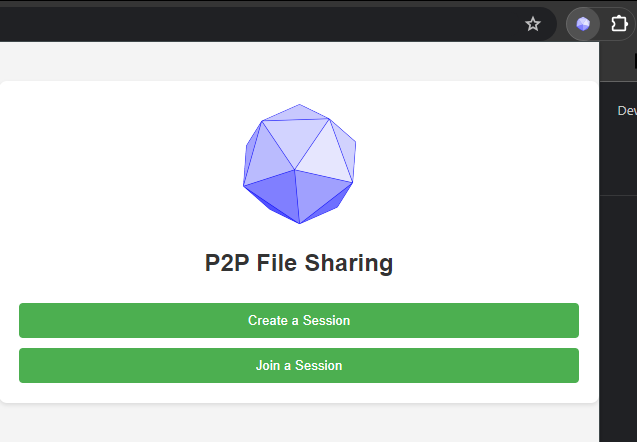

<a name="readme-top"></a>
<br />

<br />
<div align="center">
  <a href="https://github.com/javierlinero/cipherp2p/">
    
  </a>
  <h2 align="center">Cipher P2P</h3>
  <h3 align="center">Peer2Peer File Sharing Chrome Extension</h3>
</div>

## Objective
Cipher P2P is an innovative Google Chrome extension designed for efficient peer-to-peer file sharing directly from the web browser. Leveraging WebRTC technology, it facilitates fast and secure file transfers among multiple users without the need for intermediary server storage. This tool combines ease of use with advanced technology, offering a user-friendly interface for seamless file sharing and data transfer.

### Installation
#### Client Setup:
Make sure to download our repository or clone with `git clone https://github.com/javierlinero/cipherp2p`

From there make sure you're on a Google Chrome browser, and type into the url `chrome://extensions/`

Click on the `Developer mode` on the top right and this taskbar should appear

<div align="center">
  
</div>
<br>

Now click on `Load unpacked` and make sure to upload the `cipherp2p` repository you just downloaded, and you can click on the extension on the top right and it should appear as so:
<br>
<div align="center">
  
</div>

#### Local Backend Setup:

If you're interested in setting up your own local hosted signalling server make sure to set a designated environment variable named `PORT`, with a proper designated port. 
Likewise you need to setup a `TURN_API_KEY` for the TURN server and we recommend using metered!

Then, make sure all the dependencies are correct using `go mod tidy`, and then you can run your own local server by 

```sh
cd /path/to/cipherp2p/backend
go run main.go
```

Otherwise you're more than welcome to use the deployed `Heroku` & `Metered` servers to use this chrome extension with friends!


### Built With


